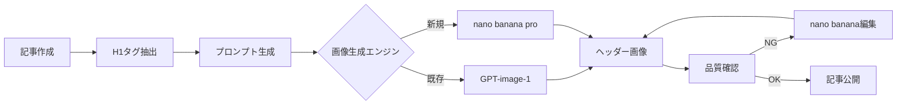

# nano banana pro MCPサーバー使用ガイド

## 目次
1. [概要](#概要)
2. [セットアップガイド](#セットアップガイド)
3. [設定ファイル](#設定ファイル)
4. [使用可能な機能](#使用可能な機能)
5. [実践的な使用例](#実践的な使用例)
6. [既存システムとの統合](#既存システムとの統合)
7. [トラブルシューティング](#トラブルシューティング)

## 概要

### nano banana proとは

**nano banana pro**（別名：**Gemini 3 Pro Image**）は、GoogleのAI画像生成・編集モデルの最新版です。

| 項目 | 詳細 |
|------|------|
| 正式名称 | Gemini 3 Pro Image |
| 通称 | nano banana pro |
| 開発元 | Google DeepMind |
| リリース | 2025年（有料プレビュー版） |
| 基本モデル | Gemini 2.5 Flash Image（通常のNano Banana）の上位版 |
| 料金体系 | 従量課金制（無料枠あり） |

### MCPサーバーとしての特徴

- **高品質画像生成**: テキストプロンプトから高品質な画像を生成
- **日本語対応**: 日本語テキストの完全サポート
- **反復編集**: 生成した画像を継続的に改良可能
- **スタイル転送**: 参照画像のスタイルを適用
- **MCP統合**: Claude Desktop、Cursor、VS Codeから直接利用可能

## セットアップガイド

### 前提条件

- **Node.js**: 18.0.0以上
- **Python**: 3.11以上（Python版を使用する場合）
- **Google AI Studio APIキー**: Gemini APIへのアクセス権限

### インストール手順

#### 方法1: NPMによるインストール（推奨）

```bash
# グローバルインストール
npm install -g nano-banana-mcp

# プロジェクトローカルインストール
npm install nano-banana-mcp

# 直接実行（インストール不要）
npx nano-banana-mcp
```

#### 方法2: Python版のインストール

```bash
# uvxを使用（推奨）
uvx nanobanana-mcp-server@latest

# pipを使用
pip install nanobanana-mcp-server
```

#### 方法3: 開発版のセットアップ

```bash
# リポジトリのクローン
git clone https://github.com/ConechoAI/Nano-Banana-MCP.git
cd Nano-Banana-MCP

# 依存関係のインストール
npm install

# 開発モードで実行
npm run dev
```

### APIキーの取得

1. **Google AI Studioにアクセス**
   ```
   URL: https://ai.studio/banana
   ```

2. **APIキーの生成**
   - 左ナビゲーションの「Get API key」をクリック
   - 「Create API Key」ボタンをクリック
   - 生成されたAPIキーをコピー

3. **料金プラン**
   - **無料枠**: 月数百回の画像生成
   - **従量課金**:
     - 入力: $0.30/100万トークン
     - 出力: $0.039/画像（1024×1024px）
     - 4K画像: $0.156/画像（4096×4096px）

## 設定ファイル

### Claude Desktop用設定

**設定ファイルの場所**:
- Windows: `%APPDATA%\Claude\claude_desktop_config.json`
- macOS: `~/Library/Application Support/Claude/claude_desktop_config.json`
- Linux: `~/.config/Claude/claude_desktop_config.json`

**基本設定例**:
```json
{
  "mcpServers": {
    "nano-banana": {
      "command": "npx",
      "args": ["nano-banana-mcp"],
      "env": {
        "GEMINI_API_KEY": "your-gemini-api-key-here"
      }
    }
  }
}
```

**詳細設定例**（出力ディレクトリ指定）:
```json
{
  "mcpServers": {
    "nano-banana": {
      "command": "npx",
      "args": ["nano-banana-mcp"],
      "env": {
        "GEMINI_API_KEY": "your-gemini-api-key-here",
        "IMAGE_OUTPUT_DIR": "C:/ai_programming/seo_ai/01_kiji/generated-images",
        "LOG_LEVEL": "INFO",
        "DEFAULT_QUALITY": "hd",
        "DEFAULT_SIZE": "1792x1024"
      }
    }
  }
}
```

### Python版の設定

```json
{
  "mcpServers": {
    "nanobanana": {
      "command": "uvx",
      "args": ["nanobanana-mcp-server@latest"],
      "env": {
        "GEMINI_API_KEY": "your-gemini-api-key-here",
        "IMAGE_OUTPUT_DIR": "C:/ai_programming/seo_ai/01_kiji/generated-images",
        "LOG_LEVEL": "INFO"
      }
    }
  }
}
```

### 環境変数の設定（オプション）

**Windows（PowerShell）**:
```powershell
[Environment]::SetEnvironmentVariable("GEMINI_API_KEY", "your-api-key", "User")
```

**macOS/Linux（.bashrc/.zshrc）**:
```bash
export GEMINI_API_KEY="your-api-key"
export IMAGE_OUTPUT_DIR="~/nano-banana-images"
```

## 使用可能な機能

### 1. generate_image - 新規画像生成

テキストプロンプトから画像を生成します。

**パラメータ**:
- `prompt` (必須): 画像生成用のテキストプロンプト
- `size` (オプション): 画像サイズ（デフォルト: "1024x1024"）
- `quality` (オプション): 品質設定（"standard" または "hd"）
- `style` (オプション): スタイル（"vivid" または "natural"）
- `save_path` (オプション): 保存先のパス

**使用例**:
```javascript
// 基本的な使用
generate_image({
  prompt: "富士山の日の出、浮世絵風、桜の花びらが舞う"
})

// 詳細設定付き
generate_image({
  prompt: "モダンな日本家屋、ミニマリストデザイン、自然光",
  size: "1792x1024",
  quality: "hd",
  style: "vivid",
  save_path: "C:/images/modern-house.png"
})
```

### 2. edit_image - 既存画像の編集

既存の画像をテキスト指示で編集します。

**パラメータ**:
- `imagePath` (必須): 編集する画像のパス
- `prompt` (必須): 編集指示のテキスト
- `referenceImages` (オプション): スタイル参照画像のパス配列
- `mask_path` (オプション): マスク画像（編集領域指定）

**使用例**:
```javascript
// 基本的な編集
edit_image({
  imagePath: "C:/images/house.png",
  prompt: "空を夕焼けに変更し、照明を暖かいトーンに"
})

// スタイル転送付き編集
edit_image({
  imagePath: "C:/images/building.png",
  prompt: "建物を和風建築のスタイルに変換",
  referenceImages: ["C:/references/japanese-style.jpg"]
})
```

### 3. continue_editing - 継続編集

最後に生成または編集した画像を継続的に編集します。

**パラメータ**:
- `prompt` (必須): 追加の編集指示
- `referenceImages` (オプション): スタイル参照画像

**使用例**:
```javascript
// 前回の画像に追加編集
continue_editing({
  prompt: "前景に人物のシルエットを追加、全体的により暗く神秘的に"
})
```

### 4. configure_gemini_token - APIキー設定

実行時にAPIキーを設定または更新します。

**使用例**:
```javascript
configure_gemini_token({
  apiKey: "new-api-key-here"
})
```

## 実践的な使用例

### SEO記事用ヘッダー画像の自動生成

#### 例1: 不動産記事のヘッダー画像

```javascript
// 記事タイトルから画像を生成
const articleTitle = "空き家の固定資産税が6倍に！2025年の法改正を徹底解説";
const keyword = "6倍";

generate_image({
  prompt: `Professional Japanese real estate marketing banner:
    Vacant old Japanese house with overgrown garden.
    White bold gothic font displaying "${articleTitle}" prominently at top.
    Yellow highlighted keyword "${keyword}" for emphasis.
    Date stamp "2025年" in bottom right corner.
    Text has shadow effect for readability.
    Photorealistic property image, natural lighting, cloudy sky suggesting concern.
    Size: 1792x1024 pixels, horizontal banner format.`,
  size: "1792x1024",
  quality: "hd",
  style: "vivid"
})
```

#### 例2: バッチ処理スクリプト

```javascript
// batch_generate_headers.js
const fs = require('fs');
const path = require('path');

// H1タグ情報を読み込み
const h1Data = JSON.parse(
  fs.readFileSync('extracted_h1_data.json', 'utf-8')
);

// 各記事のヘッダー画像を生成
for (const article of h1Data) {
  const prompt = `Professional Japanese marketing banner:
    ${article.propertyType} in ${article.location}.
    White bold font: "${article.mainText}".
    Yellow highlight: "${article.keyword}".
    Subtitle: "${article.subText}".
    Date: "${article.year}".
    Photorealistic, 1792x1024.`;

  generate_image({
    prompt: prompt,
    size: "1792x1024",
    quality: "hd",
    save_path: `商材/買取くん_エリア/記事/ヘッダ画像/${article.filename}.png`
  });

  // レート制限対策で待機
  await new Promise(resolve => setTimeout(resolve, 3000));
}
```

### 画像の多言語ローカライゼーション

```javascript
// 日本語版から英語版への変換
edit_image({
  imagePath: "headers/japanese-banner.png",
  prompt: `Replace all Japanese text with English equivalents:
    "買取くん" → "KAITORI-KUN"
    "空き家買取" → "Vacant House Purchase"
    "6時間査定" → "6-Hour Assessment"
    "3日現金化" → "3-Day Cash Payment"
    Maintain exact same design and layout, only change text language.`
})
```

### A/Bテスト用バリエーション作成

```javascript
// オリジナル画像から複数のバリエーションを作成
const original = "headers/original-header.png";

// バリエーション1: 明るいトーン
edit_image({
  imagePath: original,
  prompt: "Make the image 30% brighter and more optimistic tone",
  save_path: "headers/variant-bright.png"
})

// バリエーション2: プロフェッショナルなトーン
edit_image({
  imagePath: original,
  prompt: "Add professional business overlay, corporate blue tint",
  save_path: "headers/variant-professional.png"
})

// バリエーション3: 緊急性を強調
edit_image({
  imagePath: original,
  prompt: "Add red warning elements, urgent messaging style",
  save_path: "headers/variant-urgent.png"
})
```

## 既存システムとの統合

### 現在のGPT-image-1システムとの比較

| 機能 | GPT-image-1（現行） | nano banana pro |
|------|-------------------|-----------------|
| 日本語テキスト | ✅ 完全対応 | ✅ 完全対応 |
| 生成速度 | 5-10秒 | 3-7秒 |
| 画質 | HD（1792x1024） | HD/4K対応 |
| 編集機能 | ❌ なし | ✅ あり |
| 継続編集 | ❌ なし | ✅ あり |
| スタイル転送 | △ プロンプトのみ | ✅ 参照画像使用可 |
| 料金 | $0.040/画像 | $0.039/画像 |
| バッチ処理 | ✅ 可能 | ✅ 可能 |

### 移行メリット

1. **コスト削減**: 画像あたり$0.001の削減（2.5%）
2. **編集機能**: 生成後の微調整が可能
3. **品質向上**: 4K解像度オプション
4. **効率化**: 継続編集による反復作業の削減

### 既存スクリプトとの統合

**extract_h1_for_images.pyとの連携**:
```python
# generate_with_nano_banana.py
import json
import subprocess

# 既存のH1データを読み込み
with open('h1_data.json', 'r', encoding='utf-8') as f:
    h1_data = json.load(f)

# nano banana proで画像生成
for item in h1_data:
    prompt = f"""Professional Japanese banner:
    {item['property_type']} in {item['location']}.
    Main text: "{item['main_text']}"
    Keyword: "{item['keyword']}" (yellow highlight)
    Size: 1792x1024, HD quality"""

    # MCPツール経由で生成
    subprocess.run([
        'node', 'generate-image.js',
        '--prompt', prompt,
        '--output', f"headers/{item['filename']}.png"
    ])
```

### ワークフロー統合案



## トラブルシューティング

### よくある問題と解決方法

#### 1. 認証エラー

**エラー**:
```
Error: Invalid API key or authentication failed
```

**解決方法**:
1. APIキーが正しく設定されているか確認
   ```bash
   echo $GEMINI_API_KEY  # macOS/Linux
   echo %GEMINI_API_KEY%  # Windows
   ```

2. Claude Desktop設定ファイルを確認
   ```json
   {
     "mcpServers": {
       "nano-banana": {
         "env": {
           "GEMINI_API_KEY": "AIza..."  // 正しいキーか確認
         }
       }
     }
   }
   ```

3. APIキーの権限確認（Google AI Studioで確認）

#### 2. レート制限エラー

**エラー**:
```
Error: Rate limit exceeded. Please wait before making another request
```

**解決方法**:
```javascript
// レート制限対策付きバッチ処理
async function generateWithRateLimit(prompts) {
  for (const prompt of prompts) {
    try {
      await generate_image({ prompt });
      // 3秒待機
      await new Promise(resolve => setTimeout(resolve, 3000));
    } catch (error) {
      if (error.message.includes('Rate limit')) {
        // 30秒待機して再試行
        await new Promise(resolve => setTimeout(resolve, 30000));
        await generate_image({ prompt });
      }
    }
  }
}
```

#### 3. 画像保存エラー

**エラー**:
```
Error: Cannot save image to specified path
```

**解決方法**:
1. 保存先ディレクトリの存在確認
   ```bash
   mkdir -p C:/ai_programming/seo_ai/01_kiji/generated-images
   ```

2. 書き込み権限の確認（Windows）
   ```powershell
   icacls "C:\ai_programming\seo_ai\01_kiji\generated-images" /grant Users:F
   ```

3. パスの形式確認（スラッシュ/バックスラッシュ）

#### 4. MCP接続エラー

**エラー**:
```
MCP server nano-banana failed to start
```

**解決方法**:
1. Node.jsバージョン確認
   ```bash
   node --version  # v18.0.0以上必要
   ```

2. パッケージ再インストール
   ```bash
   npm uninstall -g nano-banana-mcp
   npm install -g nano-banana-mcp
   ```

3. Claude Desktopを再起動

### デバッグ方法

#### ログレベルの設定

```json
{
  "mcpServers": {
    "nano-banana": {
      "env": {
        "LOG_LEVEL": "DEBUG"  // DEBUG, INFO, WARN, ERROR
      }
    }
  }
}
```

#### ログファイルの確認

**Windows**:
```powershell
Get-Content "$env:APPDATA\nano-banana\logs\latest.log" -Tail 50
```

**macOS/Linux**:
```bash
tail -f ~/.nano-banana/logs/latest.log
```

#### テストコマンド

```bash
# 接続テスト
npx nano-banana-mcp test

# バージョン確認
npx nano-banana-mcp --version

# 設定確認
npx nano-banana-mcp config
```

### パフォーマンス最適化

#### 1. 画像サイズの最適化

```javascript
// 用途別の推奨サイズ
const imageSizes = {
  'ヘッダー画像': '1792x1024',  // 横長バナー
  'サムネイル': '512x512',      // 正方形サムネイル
  'SNSシェア': '1200x630',      // OGP画像
  '記事内画像': '1024x768'       // 標準的な記事画像
};
```

#### 2. キャッシュの活用

```javascript
// 生成済み画像のキャッシュ管理
const imageCache = new Map();

async function generateOrGetCached(prompt, cacheKey) {
  if (imageCache.has(cacheKey)) {
    return imageCache.get(cacheKey);
  }

  const image = await generate_image({ prompt });
  imageCache.set(cacheKey, image);
  return image;
}
```

#### 3. 並列処理の実装

```javascript
// 複数画像の並列生成（レート制限考慮）
async function parallelGenerate(prompts, concurrency = 3) {
  const results = [];
  for (let i = 0; i < prompts.length; i += concurrency) {
    const batch = prompts.slice(i, i + concurrency);
    const batchResults = await Promise.all(
      batch.map(p => generate_image({ prompt: p }))
    );
    results.push(...batchResults);

    // バッチ間で待機
    if (i + concurrency < prompts.length) {
      await new Promise(resolve => setTimeout(resolve, 2000));
    }
  }
  return results;
}
```

## まとめ

nano banana pro（Gemini 3 Pro Image）は、Google DeepMindの最先端AI画像生成技術をMCPプロトコル経由で利用できる強力なツールです。

### 主な利点

1. **コスト効率**: 既存システムより低コスト
2. **高機能**: 編集・継続編集機能で柔軟な画像制作
3. **日本語対応**: 完全な日本語テキストサポート
4. **統合容易**: 既存のMCPクライアントから即利用可能
5. **拡張性**: バッチ処理やカスタムワークフローの構築が容易

### 推奨される使用シナリオ

- ✅ SEO記事のヘッダー画像自動生成
- ✅ 多言語コンテンツのローカライゼーション
- ✅ A/Bテスト用の画像バリエーション作成
- ✅ ブランドガイドラインに沿った画像の大量生成
- ✅ 既存画像の最適化と改善

### 次のステップ

1. APIキーを取得してMCP設定を完了
2. テスト画像を生成して品質を確認
3. 既存のワークフローに段階的に統合
4. パフォーマンスとコストを監視
5. 必要に応じてPro版への移行を検討

---

**更新履歴**:
- 2025-11-21: 初版作成
- 作成者: Claude Code (claude.ai/code)

**関連ドキュメント**:
- [ヘッダ画像自動生成ガイド](./ヘッダ画像自動生成ガイド.md)
- [プラットフォーム別記事作成注意点](./プラットフォーム別記事作成注意点.md)
- [統計データ引用ガイドライン](./統計データ引用ガイドライン.md)